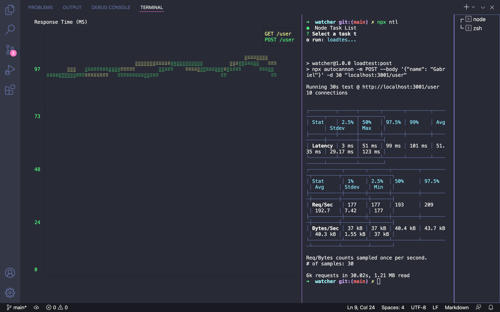

# Watcher

Watcher is an application to monitor Web APIs performance using the JS Decorators.

<h1 align="center">
  
</h1>

## How to execute

1) Clone the repository and access the folder

```bash
git clone https://github.com/GabrielCS0/watcher.git
cd watcher
```

2) Follow the steps below

```bash
# Install the dependencies
yarn

# To see available commands
npx ntl
```

## License

This project is licensed under the MIT License - see the [LICENSE](https://github.com/GabrielCS0/watcher/blob/main/LICENSE) file for details.